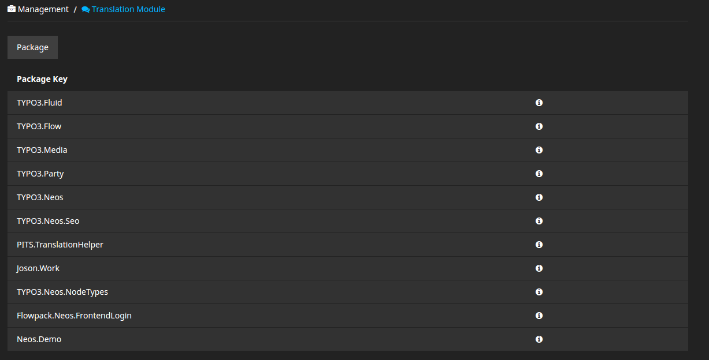
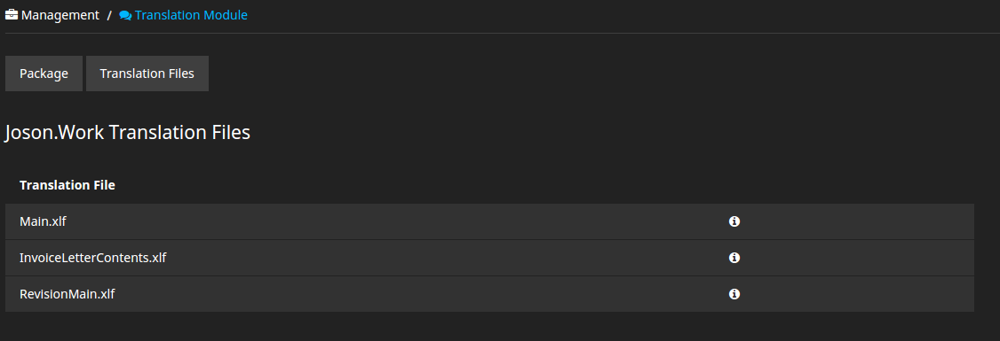
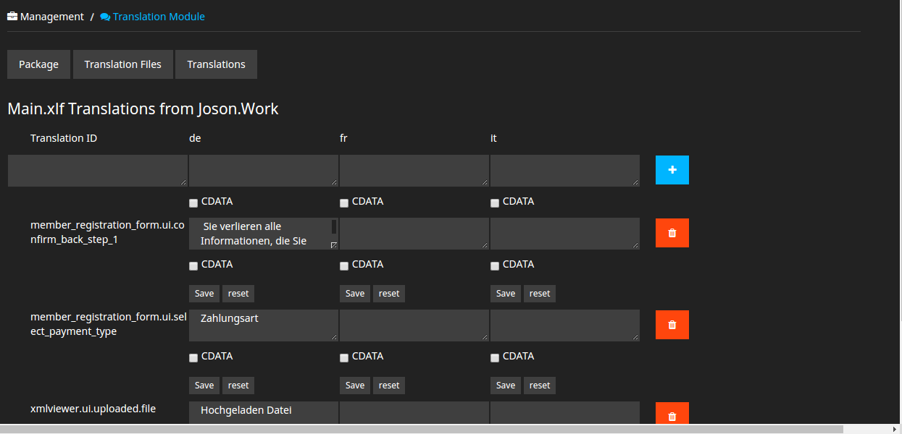

# PITS.TranslationHelper
This backend plugin is used for managing translations in the translation files of NEOS CMS.
## Installation steps

-   First Install this NEOS CMS plugin using composer.
```
composer require pits/translationhelper
```
-   Add following in top level Configuration/Routes.yaml just after the TYPO3 Neos route.
```
-
  name: 'pitsTranslationHelper'
  uriPattern: '<pitsTranslationHelperSubroutes>'
  defaults:
    '@package': 'PITS.TranslationHelper'

  subRoutes:
    'pitsTranslationHelperSubroutes':
      package: 'PITS.TranslationHelper'
```
-   Flush all caches using the below command
```
php ./flow neos.flow:cache:flush
```
-   Warm up caches using the below command
```
php ./flow neos.flow:cache:warmup
```
-   Open your NEOS CMS site backend, then you can see **Translation Module** under **Management** main module.

## Plugin Details
-   First page of this backend plugin contains a list of packages that contain translation files.

-   If a user click any of the package, then this particular user enters into the translation files list page. The below screenshot shows the list of translation files inside **Joson.Work** package.

-   If a user click any of the translation file, then this particular user enters into the translation units list page. The below screenshot shows the list of translation units inside **Main.xlf** file.


## uninstall step
-   Remove this package using composer.
```
composer remove pits/translationhelper
```
-   remove completely below mentioned route configuration code from Configuration/Routes.yaml file.
```
-
  name: 'pitsTranslationHelper'
  uriPattern: '<pitsTranslationHelperSubroutes>'
  defaults:
    '@package': 'PITS.TranslationHelper'

  subRoutes:
    'pitsTranslationHelperSubroutes':
      package: 'PITS.TranslationHelper'
```
-   Flush all caches using the below command
```
php ./flow neos.flow:cache:flush
```
-   Warm up caches using the below command
```
php ./flow neos.flow:cache:warmup
```
